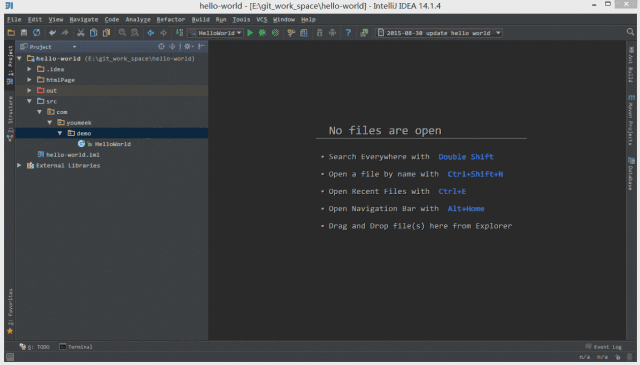
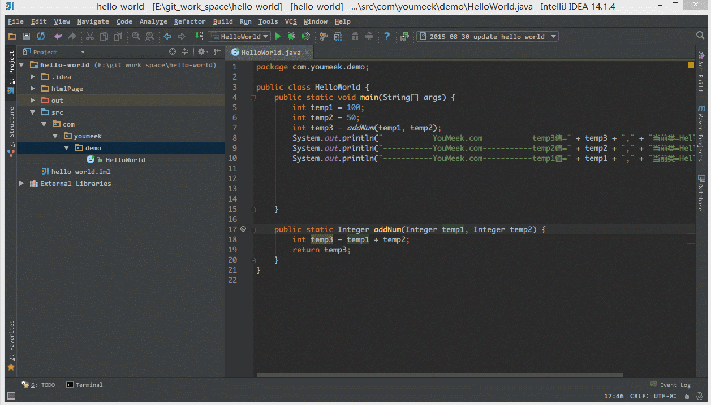
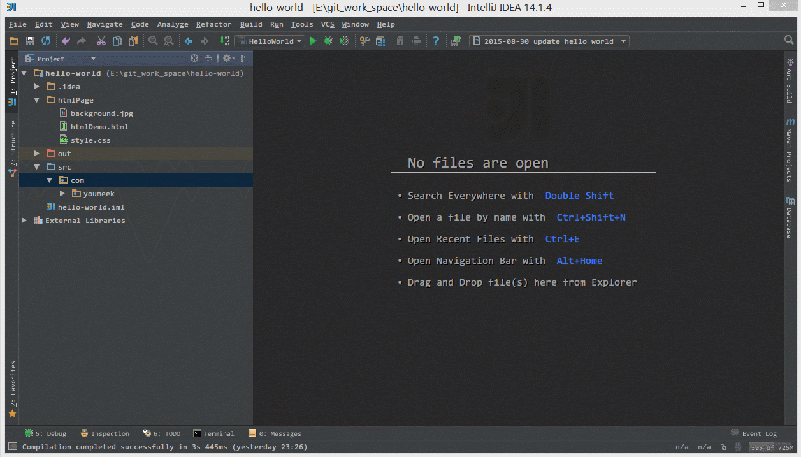

## 说明
IDEA 全称IntelliJ IDEA，是用于JAVA语言开发的集成环境（也可用于其他语言），IntelliJ在业界被公认为最好的java开发工具之一，尤其在智能代码助手、代码自动提示，重构，JavaEE支持，Ant，Junit，CSV整合，代码审查、 创新的GUI设计等方面的功能可以说是超常的。

## 一、视图模式
```
Ctrl+F12 查看file，method结构图、类继承机构图
```
不知道方法结构，使用Ctrl+F12，方法，参数，返回值将展现出来
```
Ctrl+shift+Alt+U   查看maven依赖，类图
```
使用maven做项目时，依赖往往非常多，在配置依赖的文件中只需要Ctrl+shift+Alt+U，所有依赖都以拓扑图的方式展现出来，所有的关系和位置都能找到

类图：我们阅读源码的时候，想知道各个类之间的关系怎么办，Ctrl+shift+Alt+U，所有依赖都以拓扑图的方式展现出来，所有的关系和位置都能找到，以ArrayList为例：


## 二、定位
- 1. 项目之间的跳转
```
Ctrl+Alt+[　　跳转到下一个项目
Ctrl+Alt+]　　跳转到上一个项目
```
- 2. 文件之间的跳转
```
Ctrl+E　　 定位到最近浏览过的文件 
Ctrl+Shift+E　　最近更改的文件
Shift+Click　　可以关闭文件
```
- 3. 位置的跳转
```
Ctrl+Shift+Backspace　　 跳转上一次修改的地方
Ctrl+Alt+B　　跳转到方法实现处
Ctrl+Shift+左箭头　　上一个浏览的地方
Ctrl+Shift+右箭头　　下一个浏览的地方
```
- 4. 其他的跳转
```
Ctrl+H　　显示类结构图（类的继承层次）
Ctrl+Q　　显示注释文档
Alt+1　　快速打开或隐藏工程面板
Alt+left/right　　切换代码视图
F2 或 Shift+F2　　高亮错误或警告快速定位
Tab　　代码标签输入完成后，按 Tab，生成代码
Ctrl+Shift+F7　　高亮显示所有该文本，按 Esc 高亮消失
```
- 5. 搜索
```
Ctrl＋N　　快速搜索类
Ctrl＋Shift＋N　　快速搜索文件
Ctrl＋Alt+Shift＋N　　快速搜索函数
```

三个里面都有Include non-porjecct items选项,勾选则表示非当前文件中的jar里面所有的类也会被查找


```
Ctrl+Shift+F　　快速搜索字符串
```


```
Alt+F1　　查找代码所在位置
Alt+F3　　逐个往下查找相同文本，并高亮显示
```

- 6. 光标移动和选中
```
Ctrl＋Alt+Shift＋J 选中所有相应的目标
Alt+Up/Down　　在方法间快速移动定位
Ctrl+Shift+Up/Down　　向上/下移动语句
Ctrl+Up/Down　　光标中转到第一行或最后一行下
Ctrl+B/Ctrl+Click　　快速打开光标处的类或方法（跳转到定义处）
```

## 三、Alt+Enter
- 1. 提供代码提示
- 2.自动创建函数
- 3.list replace
- 4.实现接口
- 5.单词拼写
- 6.导包

## 四、抽取
我们按照自己的需求，选择抽取一个还是抽取所有；
```
Ctrl+Alt+C    抽取静态变量

Ctrl+Alt+F    抽取成员变量
```
使用方法和抽取变量类似
```
Ctrl+Alt+P　　抽取方法参数

Ctrl+Alt+M　　抽取方法
```
当一个方法长度过长的时候，只需要把代码分离成多个模块，选中各个模块只要Ctrl+Alt+M就能抽取为一个新的方法，我们只需要引用就好


## 常用设置

IntelliJ IDEA 的代码提示和补充功能有一个特性：区分大小写。如上图标注 1 所示，默认就是 First letter 区分大小写的。

区分大小写的情况是这样的：比如我们在 Java 代码文件中输入 stringBuffer IntelliJ IDEA 是不会帮我们提示或是代码补充的，但是如果我们输入 StringBuffer 就可以进行代码提示和补充。

如果想不区分大小写的话，改为 None 选项即可。

如上图 Gif 所示，该功能用来快速设置代码检查等级。我个人一般在编辑大文件的时候会使用该功能。

IntelliJ IDEA 对于编辑大文件并没有太大优势，很卡，原因就是它有各种检查，这样是非常耗内存和 CPU 的，所以为了能加快大文件的读写，我一般会暂时性设置为 None。
+ Inspections 为最高等级检查，可以检查单词拼写，语法错误，变量使用，方法之间调用等。
+ Syntax 可以检查单词拼写，简单语法错误。
+ None 不设置检查。


如上图标注 1 和 2 所示，默认 IntelliJ IDEA 是没有开启自动 import 包的功能。
- 勾选标注 1 选项，IntelliJ IDEA 将在我们书写代码的时候自动帮我们优化导入的包，比如自动去掉一些没有用到的包。
- 勾选标注 2 选项，IntelliJ IDEA 将在我们书写代码的时候自动帮我们导入需要用到的包。但是对于那些同名的包，还是需要手动 Alt + Enter 进行导入的，IntelliJ IDEA 目前还无法智能到替我们做判断。


如上图标注 1 所示，当我们 Java 类中导入的某个包下类超过这里设置的指定个数，就会换成用 * 号来代替。


如上图 Gif 所示，IntelliJ IDEA 默认是会折叠空包的，这样就会出现包名连在一起的情况。但是有些人不喜欢这种结构，喜欢整个结构都是完整树状的，所以我们可以去掉演示中的勾选框即可。


如上图标注 1 所示，IntelliJ IDEA 有一种叫做 省电模式 的状态，开启这种模式之后 IntelliJ IDEA 会关掉代码检查和代码提示等功能。

所以一般我也会认为这是一种 阅读模式，如果你在开发过程中遇到突然代码文件不能进行检查和提示可以来看看这里是否有开启该功能。

如上图 Gif 所示，在我们按 Ctrl + Shift + N 进行打开某个文件的时候，我们可以直接定位到改文件的行数上。

一般我们在调 CSS，根据控制台找空指针异常的时候，使用该方法速度都会相对高一点。

如上图标注红圈所示，我们可以对指定代码类型进行默认折叠或是展开的设置，勾选上的表示该类型的代码在文件被打开的时候默认是被折叠的，去掉勾选则反之。


如上图 Gif 所示，IntelliJ IDEA 支持对代码进行垂直或是水平分组。一般在对大文件进行修改的时候，有些修改内容在文件上面，有些内容在文件下面，如果来回操作可能效率会很低，用此方法就可以好很多。当然了，前提是自己的浏览器分辨率要足够高。


如上图箭头所示，IntelliJ IDEA 默认是开启单词拼写检查的，有些人可能有强迫症不喜欢看到单词下面有波浪线，就可以去掉该勾选。

但是我个人建议这个还是不要关闭，因为拼写检查是一个很好的功能，当大家的命名都是标准话的时候，这可以在不时方便地帮我们找到代码因为拼写错误引起的 Bug。

如上图 Gif 所示，我们可以对组件窗口的子窗口进行拖动移位，有时候设置过头或是效果不满意，那我们需要点击此按钮进行窗口还原。


如上图 Gif 所示，在没有对 Ctrl + D 快捷键进行修改前，此快捷键将是用来复制并黏贴所选的内容的，但是黏贴的位置是补充在原来的位置后，我个人不喜欢这种风格，我喜欢复制所选的行数完整内容，所以进行了修改，修改后的效果如上图 Gif 演示。


如上图 Gif 所示，默认 Ctrl + 空格 快捷键是基础代码提示、补充快捷键，但是由于我们中文系统基本这个快捷键都被输入法占用了，所以我们发现不管怎么按都是没有提示代码效果的，原因就是在此。我个人建议修改此快捷键为 Ctrl + 逗号。


如上图 Gif 所示，IntelliJ IDEA 14 版本默认是不显示内存使用情况的，对于大内存的机器来讲不显示也无所谓，但是如果是内存小的机器最好还是显示下。如上图演示，点击后可以进行部分内存的回收。


如上图标注 1 所示，在打开很多文件的时候，IntelliJ IDEA 默认是把所有打开的文件名 Tab 单行显示的。

但是我个人现在的习惯是使用多行，多行效率比单行高，因为单行会隐藏超过界面部分 Tab，这样找文件不方便。

如上图 Gif 所示，默认 IntelliJ IDEA 对于 Java 代码的单行注释是把注释的斜杠放在行数的最开头。

我个人觉得这样的单行注释非常丑，整个代码风格很难看，所以一般会设置为单行注释的两个斜杠跟随在代码的头部。


如上图 Gif 所示，默认 Java 代码的头个花括号是不换行的，但是有人喜欢对称结构的花括号，可以进行此设置。

对于此功能我倒是不排斥，我个人也是颇喜欢这种对称结构的，但是由于这种结构会占行，使得文件行数变多，所以虽然我个人喜欢，但是也不这样设置。


如上图标注 1 所示，如果在 make 或 rebuild 过程中很慢，可以增加此堆内存设置，一般大内存的机器设置 1500 以上都是不要紧的。


如上图标注 1 所示，勾选此选项后，启动 IntelliJ IDEA 的时候，默认会打开上次使用的项目。

如果你只有一个项目的话，该功能还是很好用的，但是如果你有多个项目的话，建议还是关闭，这样启动 IntelliJ IDEA 的时候可以选择最近打开的某个项目。

如上图红圈所示，该选项是设置当我们已经打开一个项目窗口的时候，再打开一个项目窗口的时候是选择怎样的打开方式。
- Open project in new window 每次都使用新窗口打开。
- Open project in the same window 每次都替换当前已打开的项目，这样桌面上就只有一个项目窗口。
- Confirm window to open project in 每次都弹出提示窗口，让我们选择用新窗口打开或是替换当前项目窗口。


如上图 Gif 所示，对于横向太长的代码我们可以进行软分行查看。软分行引起的分行效果是 IntelliJ IDEA 设置的，本质代码是没有真的分行的。


如上图箭头所示，该设置可以增加 Ctrl + E 弹出层显示的记录文件个数。


如上图箭头所示，该设置可以增加打开的文件 Tab 个数，当我们打开的文件超过该个数的时候，早打开的文件会被新打开的替换。


如上图标注 1 所示，该区域的后缀类型文件在 IntelliJ IDEA 中将以标注 2 的方式进行打开。

如上图标注 3 所示，我们可以在 IntelliJ IDEA 中忽略某些后缀的文件或是文件夹，比如我一般会把 .idea 这个文件夹忽略。


如上图 Gif 所示，当我们设置了组件窗口的 Pinned Mode 属性之后，在切换到其他组件窗口的时候，已设置该属性的窗口不会自动隐藏。


如上图 Gif 所示，我们可以对某些文件进行添加到收藏夹，然后在收藏夹组件窗口中可以查看到我们收藏的文件。


如上图 Gif 所示，我们可以通过 Alt + F1 + 1 快捷键来定位当前文件所在 Project 组件窗口中的位置。


如上图 Gif 所示，我们可以勾选此设置后，增加 Ctrl + 鼠标滚轮 快捷键来控制代码字体大小显示。


如上图 Gif 所示，我们可以勾选此设置后，增加 Ctrl + 鼠标滚轮 快捷键来控制图片的大小显示。


如上图红圈所示，默认 IntelliJ IDEA 是没有勾选 Show line numbers 显示行数的，但是我建议一般这个要勾选上。

如上图红圈所示，默认 IntelliJ IDEA 是没有勾选 Show method separators 显示方法线的，这种线有助于我们区分开方法，所以也是建议勾选上的。

如上图 Gif 所示，我们选中要被折叠的代码按 Ctrl + Alt + T 快捷键，选择自定义折叠代码区域功能。


如上图 Gif 所示，当我们在编辑某个文件的时候，自动定位到当前文件所在的 Project 组件窗口位置。


如上图 Gif 所示，即使我们项目没有使用版本控制功能，IntelliJ IDEA 也给我们提供了本地文件历史记录。除了简单的记录之外，我们还可以给当前版本加标签。


如上图 Gif 所示，我们还可以根据选择的代码，查看该段代码的本地历史，这样就省去了查看文件中其他内容的历史了。除了对文件可以查看历史，文件夹也是可以查看各个文件变化的历史。


如上图 Gif 所示，IntelliJ IDEA 自带了代码检查功能，可以帮我们分析一些简单的语法问题和一些代码细节。


如上图 Gif 所示，IntelliJ IDEA 自带模拟请求工具 Rest Client，在开发时用来模拟请求是非常好用的。